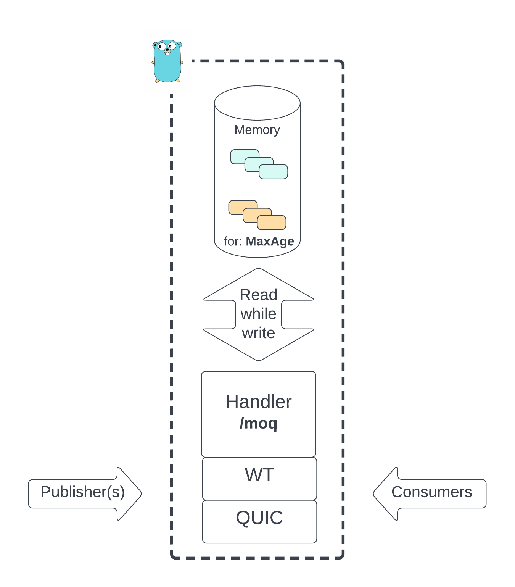

# moq-go-server

This is an experimental media MOQ relay (AKA: CDN node) based on [MOQT draft-01](https://datatracker.ietf.org/doc/draft-ietf-moq-transport/). It can be used in conjunction with following live encoder and player [moq-encoder-player](https://github.com/facebookexperimental/moq-encoder-player). Both repos allows us create a live streaming platform where we can control latency and quality (and others), so we can test scenarios from ultra low latency live (video call) to high quality (and high scale) live.


Fig1: Basic block diagram

In the following figure you can see an overview of the relay architecture


Fig1: Relay architecture overview

## Installation

To install this server in a CentOS linux instance follow the next steps:

- Create a new user, and add it to sudoers

- Configure firewall to allow:
  - Inbound
    - SSH: 22 TCP (From: [up to you])
    - WT: 4433 UDP (From: everywhere IPv4 and IPv6)
    - HTTPs: 443 (From: everywhere IPv4 and IPv6)
    - HTTPs: 80 [Optional, just testing] (From: everywhere IPv4 and IPv6)
  - Outbound
    - ALL

- Update server

```bash
sudo yum update -y
```

- Install dependencies

```bash
sudo yum install git tmux -y
```

- Install go version go1.20+

```bash
sudo yum install golang -y
```

- Install and activate a webServer

```bash
sudo yum install -y httpd
sudo systemctl start httpd
sudo systemctl enable httpd
sudo yum install mod_ssl -y
```

- Configure certificates (needed for WebTransport)
  - You can use any process you want to install valid signed certificates. We used [LetEncrypt](https://certbot.eff.org/instructions?ws=apache&os=centosrhel8)

- Configure Apache
  - Edit the main Apache configuration file `/etc/httpd/conf/httpd.conf`. Locate the "Listen 80" and add the following lines after it, replacing the example domain names.

```bash
<VirtualHost *:80>
    DocumentRoot "/var/www/html"
    ServerName "yourdomain.com"
    ServerAlias "subdomain.yourdomain.com"
</VirtualHost>

<VirtualHost *:443>
    DocumentRoot "/var/www/html"
    ServerName "yourdomain.com"
    ServerAlias "subdomain.yourdomain.com"

    SSLEngine on
    SSLCertificateFile "/etc/letsencrypt/live/subdomain.yourdomain.com/fullchain.pem"
    SSLCertificateKeyFile "/etc/letsencrypt/live/subdomain.yourdomain.com/privkey.pem"
</VirtualHost>
```

- Configure certificates
  - In this stage stage you will need to show that you own the domain you are trying to configure (You will need to answer some questions)

- Clone this repo

```bash
git clone facebookexperimental/moq-go-server
```

- Compile it

```bash
cd moq-go-server/src
go build
```

- Copy previously generated certs to allow this server to use them (careful with renewals)

```bash
cd ..
mkdir certs
sudo cp /etc/letsencrypt/live/subdomain.yourdomain.com/privkey.pem certs/certificate.key
sudo chmod 644 certs/certificate.key
sudo cp /etc/letsencrypt/live/subdomain.yourdomain.com/cert.pem certs/certificate.pem
```

- Start server inside tmux

```bash
tmux
cd src
./moq-go-server
```

See details on how use / set up this system as a live streaming relay in [moq-encoder-player testing](https://github.com/facebookexperimental/moq-encoder-player?tab=readme-ov-file#testing)

Note: To test the code in your computer and Chrome you can use the script `scripts/start-localhost-test-chrome.sh` that allows you to use WebTransport in your localhost (not safe environment)

## License

moq-go-server is released under the [MIT License](https://github.com/facebookincubator/rush/blob/master/LICENSE).
